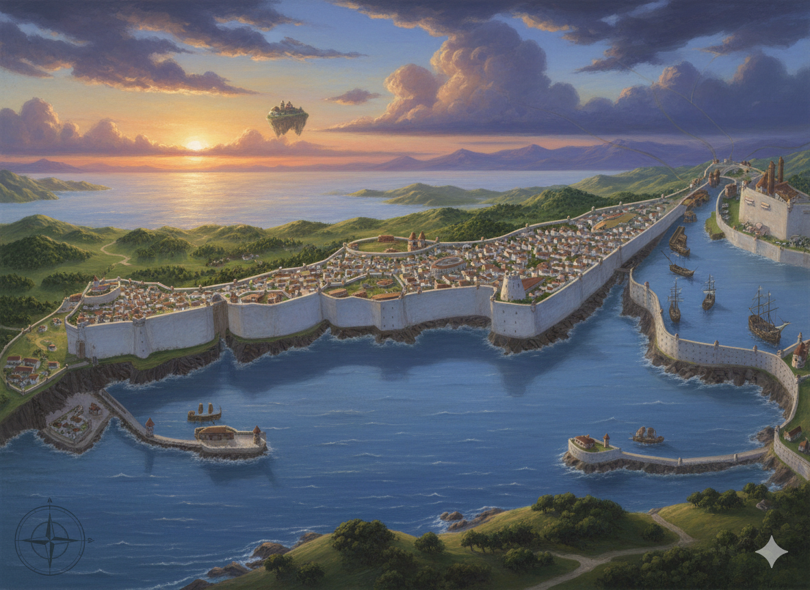
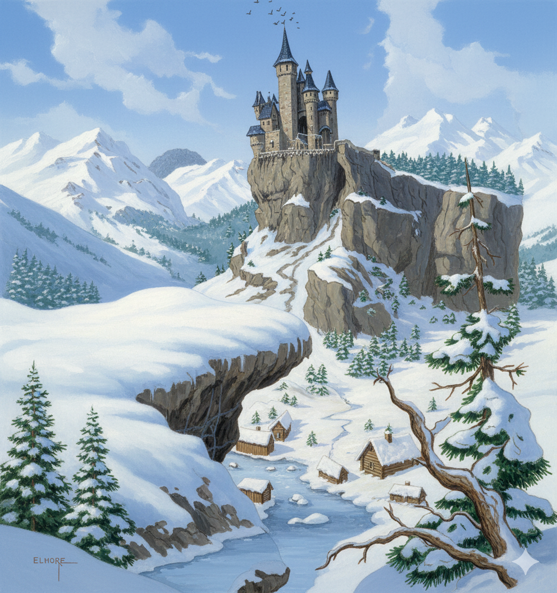
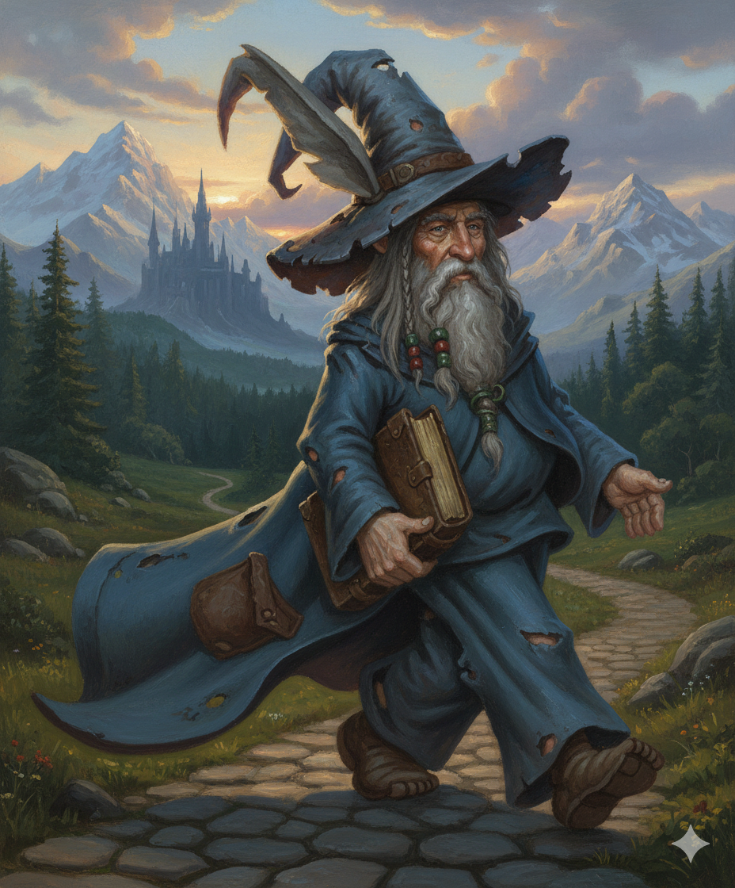
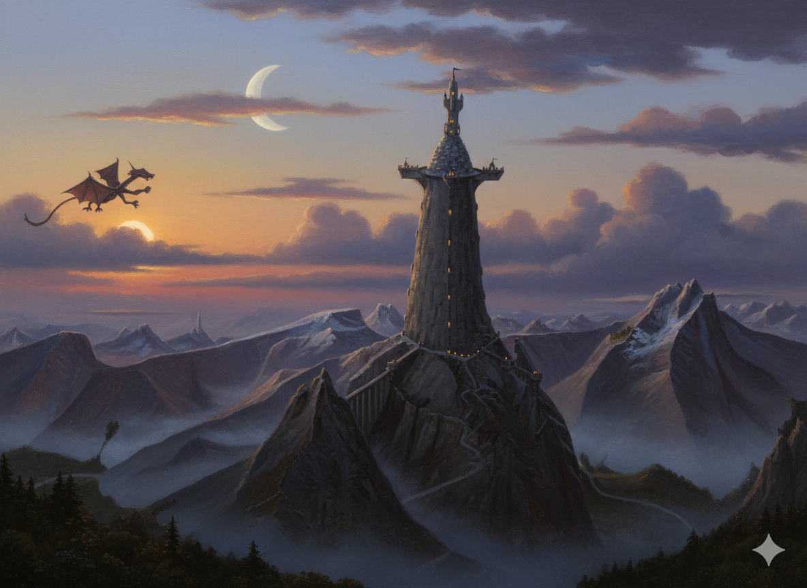

# Les Chroniques de l'Echiquier
##### Une Partie sur une multitude de Plans...

*Jadawin, la capitale impériale*

-1-

(START1) La première colonne peut commencer ici apres le el.contents = -2-‚I need to highlight these ==very important words==.

-2-

~~The world is flat.~~

- **La Forge du Forgeur Éternel** :
  - Récupérer une épée brisée dans l’Aurore Écarlate et la faire réparer par le Forgeur.
  - Piège : L’épée est maudite et tente de corrompre son porteur.

- **Le Rêve du Veilleur** :
  - Entrer dans le rêve d’un roi fou (dans le Voile Saphir) pour y voler un fragment de réalité.
  - Danger : Le rêve devient cauchemar s’ils échouent.

- **Les Jumeaux et le Lac** :
  - Réunir deux artefacts (un dans le Reflet Cyan, l’autre dans la Nuit Obsidienne) pour rétablir l’harmonie entre les plans.
  - Récompense : Un instrument de musique qui permet de voyager instantanément entre les zones de transition (1 utilisation).

Campagne centrée sur l'aventure. J'ai une autre idée de base, que je voudrais combiner. C'est inspiré des "9 princes d'Ambre" de Zelasny. L'idée est que le monde est dominé par des entités majeures (humain,demi-dieux, créatures extraordinaires, voire de puissantes guildes) qui peuvent s'identifier aux pièces d'un échiquier. Par example, le fou blanc serait representé par la guilde des bardes navigatueur des plans, la dame noire par un puissant dragon, le fou noir par un prêtre maléfique... Difficile d'hybrider cela avec l'idée des plan superposés.

## Who Rolls
Le choix est facile pour les actions des joueurs.

*Caption*

### L'origine des plans
Le model des couleurs est tres important pour la definition des mondes e t l'empietement des plans de façon continue...

> "Le destin est un dé à mille faces."  G de Nakabador

## Repeating a Roll
Les joueurs n'ont qu'une seule tentative.

@@@If you consider the pure creative aspect of starting from scratch, the "persona! touch" of individual flair that goes into preparing and running a unique campaign, or the particular style of moderating a game adventure, then Dungeon Mastering may indeed be thought of as an art.
If you consider the aspect of experimentation, the painstaking effort of preparation and attention to detail, and the continu¬ ing search for new ideas and approaches, then Dungeon Mastering is perhaps more like a science — not always exacting in a literal sense, but exacting in terms of what is required to do the job well

Esoteric questions aside, one thing is for certain - Dungeon Mastering is, above all, a labor of love. It is demanding, timeconsuming, and certainly not a task to be undertaken lightly (the sheer bulk of the book you hold in your hand will tell you that!). But, as all DM's know, the rewards are great — an endless challenge to the imagination and intellect, an enjoyable pastime to fill many hours with fantastic and often unpredictable happenings, and an opportunity to watch a story unfold and a grand idea to grow and flourish. The imagination knows no bounds, and the possibilities of the game of ADVANCED DUNGEONS & DRAGONS are just as limitless. Who can say what awaits each player, except a cornucopia of fantasy and heroic adventure? So much is waiting, indeed!

*Figure 1.2: Naomie, Nigel et Bulma.*

Question : Est-ce que tu cherches des idées pour une campagne de Donjons & Dragons, ou est-ce pour un projet d’écriture ou de monde imaginaire ? Je peux t’aider à approfondir un plan en particulier !

11:26

je cherche de idées pour l’ecriture d’une campagne. Je voudrais mélanger le thème des plans multiples qui s’interpenetrent à la facon des differentes composants de la lumiere. Le plan materiel étant la synthese de touts les autres. Lorsque la superposition n’est que partiel, une autre plan se definit

11:30

FinTon idée est extrêmement originale et riche en potentiel narratif ! Mélanger les plans d’existence avec une métaphore inspirée des composantes de la lumière (comme les couleurs primaires qui se combinent pour former la lumière blanche) ouvre des possibilités fascinantes pour une campagne de Donjons & Dragons ou un univers de fantasy. Voici comment tu pourrais structurer et exploiter ce concept (END1) 

## Test

*Figure: La citadelle de Garum Barkalûm*

-2-

 (NEW2)Peindre une figurine, ce n’est pas une affaire de talent inné ou de matériel hors de prix. C’est avant tout une méthode, de la patience et un peu de curiosité. En suivant les étapes de ce guide — du montage jusqu’au vernissage — vous avez désormais toutes les clés pour transformer un simple bout de plastique en une pièce unique.

Vous ferez des erreurs, c’est normal. Une peinture trop épaisse, un débordement, une couleur mal choisie : chaque raté est un apprentissage. La progression vient en peignant régulièrement, pas en attendant d’être "prêt". 2colonnes Reprenons 2 colonnes et racontons n'importe quoi, mais suffisamment pour avoir plusieurs lignes.
i (END2)

## Conseils pour le MJ

### Joue les avatars comme des personnages complexes :

Le Tisseur d’Illusions peut être espiègle ou cruel, selon l’humeur des joueurs.
La Mère des Forêts est patiente, mais impitoyable envers ceux qui détruisent la nature.

### Utilise l’environnement :

Dans la Brume Émeraude, les plantes réagissent aux émotions (ex. : les fleurs se fanent si un joueur ment).
Dans l’Ombre Magenta, les illusions s’adaptent aux peurs des PJ.

### Crée des alliances temporaires:

Les entités peuvent s’allier entre elles pour un objectif commun (ex. : le Veilleur des Rêves et l’Arbitre unissent leurs forces pour stopper une invasion du Plan Noir).
 (END3)

## Superposition Graduelle des Plans

- *Métaphore des couleurs* : Le Plan Matériel est une lumière blanche, résultat de la superposition de tous les plans.
- Transition graduelle : En s’éloignant du centre du Plan Matériel, les plans se superposent partiellement, créant des zones hybrides.

## End

test

-0-

# Les Mondes des Plans
##### Quel monde l'emportera? Celui qui aura investit le Plan Primal...

*Jadawin, la capitale impériale*

